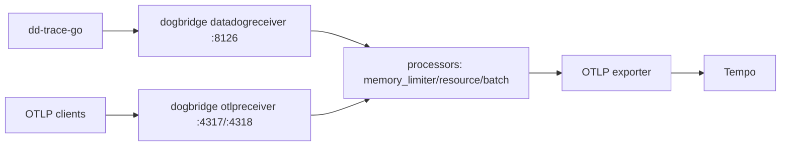
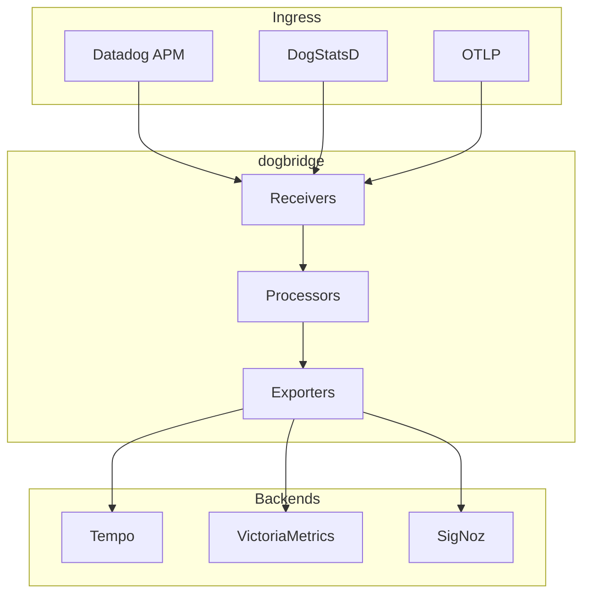

# dogbridge

`dogbridge` is an opinionated OpenTelemetry Collector distribution for teams migrating from Datadog ingestion paths to open backends.

## What works now (May 2026)

- Runnable collector entrypoint in `cmd/dogbridge`.
- Datadog APM trace ingest on `:8126` and OTLP ingest on `:4317/:4318`.
- Trace forwarding to OTLP backends (Tempo demo and SigNoz demo configs included).
- DogStatsD ingest and Prometheus remote write example in the Tempo compose config.
- Local smoke tests for traces and metrics.

## Architecture





## Quickstart (Tempo demo)

```bash
make demo-up
make demo-smoke-traces
```

Expected result: smoke test reports a trace id queryable via Tempo APIs.

## Quickstart (SigNoz demo)

```bash
make demo-signoz-up
make demo-signoz-smoke
```

Then open SigNoz at `http://localhost:3301`.

## CLI usage

```bash
# default run
./dogbridge

# explicit config
./dogbridge run --config examples/docker-compose/dogbridge.yaml

# inline override
./dogbridge run --config examples/docker-compose/dogbridge.yaml --set exporters::otlp::endpoint:tempo:4317

# version
./dogbridge version
```

## Repository layout

- `cmd/dogbridge`: cobra CLI + collector execution.
- `distro/components.go`: enabled collector factories and resolver settings.
- `examples/docker-compose`: local Tempo demo.
- `examples/docker-compose/signoz`: local SigNoz demo.
- `config/examples`: standalone OTel config examples.

## Planned next phases

- Kubernetes logs pipeline and operational hardening.
- Compatibility matrix and migration playbooks expansion.

See `IMPLEMENTATION_PLAN.md` for milestone details.

## License

Apache-2.0.
