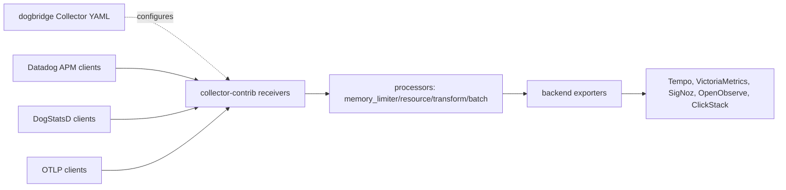

# Architecture

Dogbridge is an opinionated set of OpenTelemetry Collector configs, local demos, and validation scripts. It does not maintain a forked Collector runtime; runnable examples use upstream `otel/opentelemetry-collector-contrib`.

The repository focuses on backend-specific Collector YAML, Docker Compose demos, smoke tests, and migration documentation. Add a forked runtime only if upstream Collector components cannot satisfy a concrete requirement.
